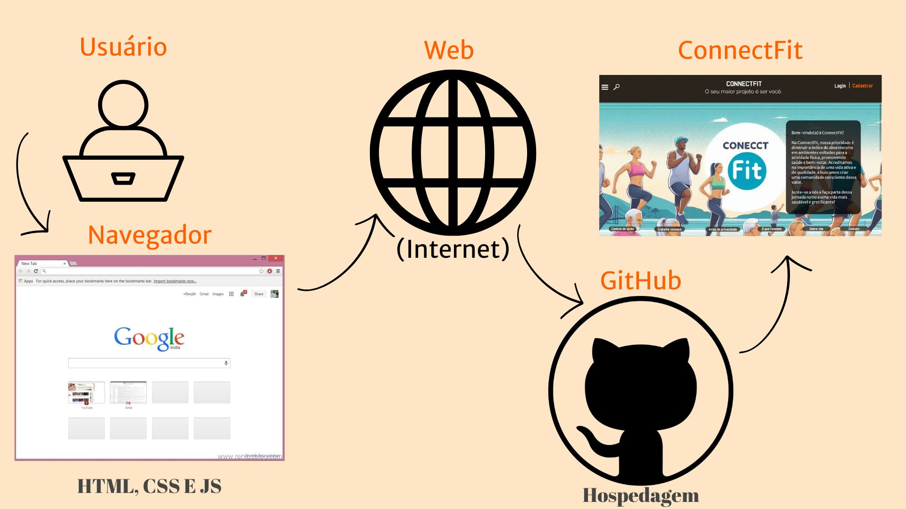

# Arquitetura da Solução

Neste segmento, vamos apresentar alguns detalhes técnicos relacionados à solução que foi criada por nossa equipe, atuando no que se refere aos elementos que fazem parte da solução e ao ambiente no qual ela se encontra hospedada. 

## Diagrama de Classes

Observando a figura abaixo se encontram os componentes que compõe a solução.

A solução implementada conta com as seguintes soluções:

-Navegador: É uma ferramenta que permite acessar a internet, a interface básica com o sistema (cliente).
-Páginas Web (internet): Conjuntos de página web, compostas por HTML, CSS, JS e imagens que implementam as funcionalidades do sistema. Pode conter texto, imagens, vídeos, e outros tipos de mídia.
-GitHub: Permite hospedar páginas web diretamente de um repositório no GitHub em uma nuvem, em arquivos de HTML, CSS e Javascript sem cobrança pela disponibilização de tais serviços, além da facilidade na disponibilização. 

## Modelo ER

O Modelo ER representa através de um diagrama como as entidades se relacionam entre si na aplicação interativa.

 - [Criando um modelo relacional - Documentação da IBM](https://www.ibm.com/docs/pt-br/cognos-analytics/10.2.2?topic=designer-creating-relational-model)

## Modelo Físico

Entregar um arquivo banco.sql contendo os scripts de criação das tabelas do banco de dados. Este arquivo deverá ser incluído dentro da pasta src\bd.

## Tecnologias Utilizadas

O objetivo é uma interface bonita, flúida, simples, objetiva e acessível. 

Utilizamos:

### IDE:
 - Visual Studio Code

- `HTML`: É utilizado para estruturar uma página web e apresentar conteúdo na web. 
- `CSS`: Utilizado para deixar o site visualmente mais atraente possibilitando a estilzação dos elementos inclusos na página web.
- `JavaScript`: Utilizamos o JS juntamente com o HTML e CSS, para validação de formulários e dados, conteúdo dinâmico entre outras possibilidades, juntamente as 3 linguagens são as principais a compor a WWW (World Wide Web). 

### Ferramentas de Modelagem:
- `Figma`
- `Canva`
- `Illustrator`

## Hospedagem

Explique como a hospedagem e o lançamento da plataforma foi feita.

> **Links Úteis**:
>
> - [Website com GitHub Pages](https://pages.github.com/)
> - [Programação colaborativa com Repl.it](https://repl.it/)
> - [Getting Started with Heroku](https://devcenter.heroku.com/start)
> - [Publicando Seu Site No Heroku](http://pythonclub.com.br/publicando-seu-hello-world-no-heroku.html)

## Qualidade de Software

Conceituar qualidade de fato é uma tarefa complexa, mas ela pode ser vista como um método gerencial que através de procedimentos disseminados por toda a organização, busca garantir um produto final que satisfaça às expectativas dos stakeholders.

No contexto de desenvolvimento de software, qualidade pode ser entendida como um conjunto de características a serem satisfeitas, de modo que o produto de software atenda às necessidades de seus usuários. Entretanto, tal nível de satisfação nem sempre é alcançado de forma espontânea, devendo ser continuamente construído. Assim, a qualidade do produto depende fortemente do seu respectivo processo de desenvolvimento.

A norma internacional ISO/IEC 25010, que é uma atualização da ISO/IEC 9126, define oito características e 30 subcaracterísticas de qualidade para produtos de software.
Com base nessas características e nas respectivas sub-características, identifique as sub-características que sua equipe utilizará como base para nortear o desenvolvimento do projeto de software considerando-se alguns aspectos simples de qualidade. Justifique as subcaracterísticas escolhidas pelo time e elenque as métricas que permitirão a equipe avaliar os objetos de interesse.

> **Links Úteis**:
>
> - [ISO/IEC 25010:2011 - Systems and software engineering — Systems and software Quality Requirements and Evaluation (SQuaRE) — System and software quality models](https://www.iso.org/standard/35733.html/)
> - [Análise sobre a ISO 9126 – NBR 13596](https://www.tiespecialistas.com.br/analise-sobre-iso-9126-nbr-13596/)
> - [Qualidade de Software - Engenharia de Software 29](https://www.devmedia.com.br/qualidade-de-software-engenharia-de-software-29/18209/)
